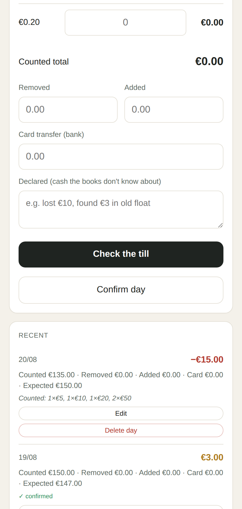
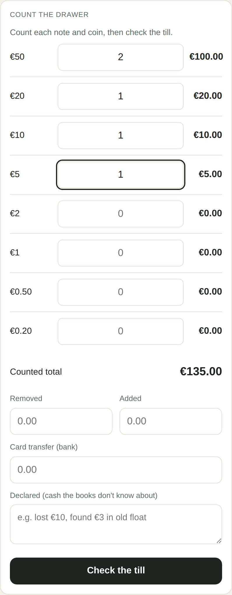
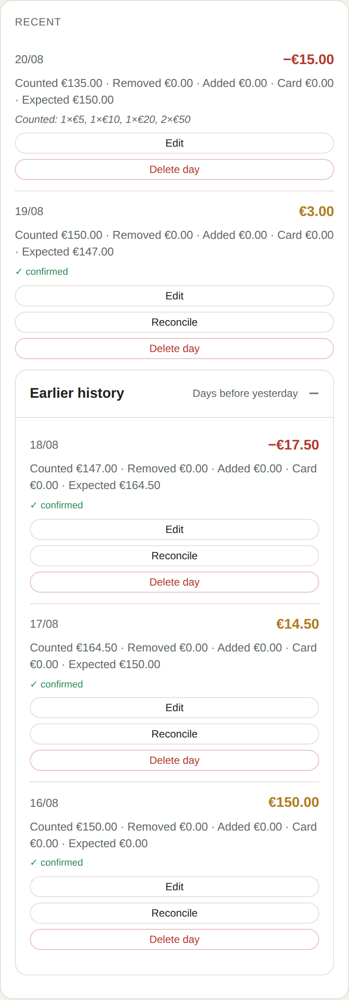

# Till Check

**Know what the till should contain.**

Till Check helps restaurant owners count the cash drawer at closing and see whether the actual balance matches the expected balance.

<p align="center">
  
</p>

## Why

A drawer can be €15 short because of a counting mistake, a cash movement, or money that is genuinely missing. Till Check shows the difference clearly and keeps a running baseline for the next count.

It does not pretend to know *why* money is missing. It gives you a reliable number so you can decide what to check next.

## How it works

<p align="center">
  
</p>

1. **Count the drawer** — enter the notes and coins.
2. **Check the till** — see balanced, over, or short in euros.
3. **Confirm the day** — accept the count as the next running balance.
4. **Review history** — see previous counts and skipped days.

<p align="center">
  
</p>

No account. No cloud. One starting value.

## Run it

Requires Node.js 22.5 or newer.

```bash
npm install
npm start
```

Open <http://localhost:3401>.

## Run the reconciliation tests

```bash
npm test
```

## Technology

Till Check is a small Node.js server with a SQLite file and one mobile-first HTML page. It uses Node's standard library, including `node:http` and `node:sqlite`—there are no runtime packages and no frontend build step.

- Money is stored as integer cents.
- The database stays on the machine running Till Check.
- The server binds to `127.0.0.1` by default.
- `TILL_PORT`, `TILL_BIND`, and `TILL_DB` can change the port, bind address, and database path.

## License

MIT
